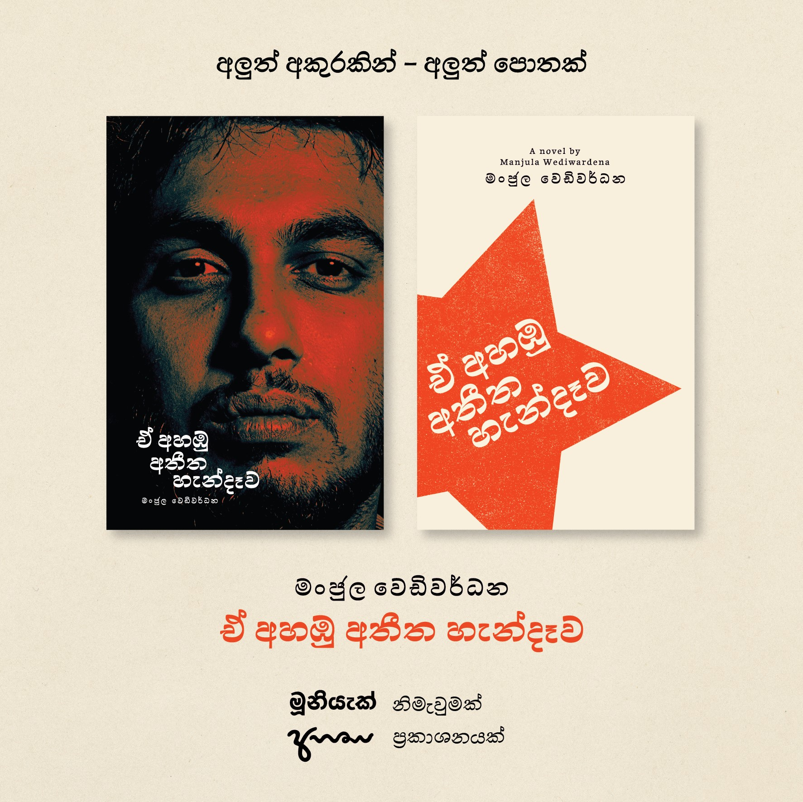

 
 
 

## මූනියැක් නිමවන සිංහල පොත්
 

<!--
මංජුල වෙඩිවර්ධනගේ ‘බත්තලංගුණ්ඩුව’ දශක පූර්ණ සංවත්සර සැමරුම (2007–2018) වෙනුවෙන් කෙරන විශේෂ මුද්‍රණය පිලිබඳව මේ තොරතුරු අප ඔබ හමුවේ තබන්නේ ඉමහත් උද්යෝගයෙන්. විශිෂ්ඨ සාහිත්‍යමය නිර්මාණයක් ලෙස පාඨක ඔබ අාදරයෙන් වැළඳගත් බත්තලංගුණ්ඩුව, එහි ප්‍රථම මුද්‍රණයෙන් දශකයක් ඉක්ම යන මොහොතේ තවත් ඔබට සමීප කරන්නයි මේ වෑයම. -->

### ඒ අහඹු අතීත හැන්දෑව - මංජුල වෙඩිවර්ධන
2018 | අහස ප්‍රකාශන  

 
 

### [දුස්ටකමේ සවුන්දර්ය සහ රත්මලානේ තවත් කතා - මංජුල වෙඩිවර්ධන→](https://medium.com/mooniak/%E0%B6%AF%E0%B7%94%E0%B7%83%E0%B7%8A%E0%B6%A7%E0%B6%9A%E0%B6%B8%E0%B7%9A-%E0%B7%83%E0%B7%80%E0%B7%94%E0%B6%B1%E0%B7%8A%E0%B6%AF%E0%B6%BB%E0%B7%8A%E0%B6%BA-%E0%B6%B4%E0%B7%9C%E0%B6%AD%E0%B6%9A%E0%B6%A7-%E0%B6%9C%E0%B7%99%E0%B6%B1%E0%B7%8F-%E0%B7%84%E0%B7%90%E0%B6%A7%E0%B7%92-941b003ba50d)  
2016 | සම ප්‍රකාශන

***

[අපේ ඊළඟ පොත් නිර්මාණ ගැන දැනගන්න ->](http://mooniak.com/subscribe)

- බත්තලංගුණ්ඩුව දශක සැමරුම් මුද්‍රණය යනු කුමක්ද?  
    මංජුල වෙඩිවර්ධන විසින් රචිත ‘බත්තලංගුණ්ඩුව’ පොත ප්‍රථම වරට ප්‍රකාශනයට පත් වී වසර 10 ක් සපිරීම නිමිත්තෙන් ම්‍රදුණය කරනු ලබන විශේෂ, සීමිත මුද්‍රණය යි.

- මෙම මුද්‍රණය විශේෂ වන්නේ ඇයි?  
    මෙම සීමිත සැමරුම් මුද්‍රණයේ නිමැවුම සාමාන්‍ය පොතක ආකෘතියෙන් තරමක් ඔබ්බට ගොස් නිර්මාණශීලීව උසස් ප්‍රමිතියෙන් නිමවේ. ඒකේ සිට දෙසියයට අංකනය කොට, මංජුල වෙඩිවර්ධනගේ අත්සනින් යුතුව ඔබ අතට පත්වීමට නියමිත මෙම නිකුතුව යලි වරක් මුද්‍රණය නොකෙරේ. ඉතා සීමිත පිටපත් ප්‍රමාණයක් ඇනවුම් ප්‍රමාණයට පමණක් මුද්‍රණය කෙරෙන අතර විශේෂයෙන්ම පොත් එකතු කරන්නට උනන්දු ඔබට ඉතා අනගි අවස්ථාවකි.

- පොතක මිල කීයද?  
    බත්තලංගුණ්ඩුව දශක සැමරුම් විශේෂ මුද්‍රණයේ ඒක් පිටපතක මිල වන්නේ රු.2990ක් පමණි. මිල මේ උපරිමය තුල තබාගන්නට අපි උත්සහ කරන්නෙමු.

- පොත් කීයක් මුද්‍රණය කරනවාද?  
    ඉතා සීමිත දෙසීයක පෑමණ පොත් ප්‍රමාණයක් මුද්‍රණය කරන්නයි බලාපොරොත්තුව.

- මට ඊළඟ මුද්‍රණයේදී මිලදී ගත හැකි ද?  
    නැහැ. මෙම නිමාවෙන් යුතු නිකුතුව එක් වරක් පමණක් මේ සීමිත පිටපත් ප්‍රමාණය පමණක් මුද්‍රණය කෙරේ.

- මේ තරම් මිල අධික ඇයි?  
    මෙය ඉහලම නිමාවකින් සහ ඉතා ප්‍රවේසමෙන් කරන නිර්මාණයක්. පොත් එකතු කරන ඔබට වඩා මෙය ගැලපෙන්නේ. සාමාන්‍ය බත්තලංගුණ්ඩුව පොත් ඔබට පහසු මිලකට වෙළඳපොලේ දී ලබාගත හැකියි.  
    මෙයින් ලැබෙන ලාභය සිංහල අක්ෂර රටා (ෆොන්ට්) නිර්මාණය සඳහා Fontlet අරමුදල ට යෙදවේ.

- පොත මිල දී ගන්නේ කෙසේ ද?  
    දැනට ඔබට පෙර-ඇනවුම් කිරීම සඳහා ලියාපදිංචි විය හැකිය. පෙර-ඇනවුම් කිරීම 2019 මාර්තු මස දී  ආරම්භ වන අතර ලියාපදිංචි වූ ඔබට මුලින්ම ඒ සඳහා අවස්තාව ලැබේ.  මුදල් ගෙවීමෙන් පසු  ඔබට ඔබේ පිටපත වෙන් කරවා ගත හැක.

- පෙර-ඇනවුම් කරන්නේ කෙසේ ද?  
    පෙර-ඇනවුම් කිරීම සඳහා මෙම සබැඳිය ට යන්න. අදාළ තොරතුරු අැතුළත් කිරීමෙන් පසුව මුදල් ගෙවිය යුතු අාකාරය පිළිබඳව උපදෙස් ඔබට ඊමේල් මගින් දැනුම් දෙනු අැති අතර මුදල් ගෙවා සම්පූර්ණ කළ පසු ඔබේ පිටපත වෙන් කරවා ගත හැක.

- පොත ගෙන්වා ගන්නේ කෙසේ ද?  
    ඔබට ඔබේ පිටපත නිවසටම ගෙන්වා ගැනීමට හෝ මූනියැක් කාර්යාලයට පැමිණ ලබා ගැනීමේ හැකියාව ඇත. පෙර-ඇනවුම් කිරීමේ දී ඔබට පොත ලබා ගැනීමට අවශ්‍ය ආකාරය සලකුණු කළ හැකි අතර නිවසටම ගෙන්වා ගැනීම සඳහා අදාළ තැපැල් ගාස්තු අය කෙරෙන බව කරුණාවෙන් සලකන්න.

- පොත මුද්‍රණය කොට අවසන් වන්නේ කවදා ද?  
    පොතේ මුද්‍රණ කටයුතු 2019 අප්‍රේල් මස නිම වීමට නියමිත අතර නිමාවෙන් පසු ඉතා ඉක්මනින් ඔබගේ ඇනවුම ඔබ වෙත ලබා දීමට අපි කටයුතු කරමු. ඒතෙක් පොතේ නිෂ්පාදන කටයුතු පිලිබඳව නවතම තොරතුරු පිලිබඳව ඊමේල් මගින් ඔබව දැනුවත් කරනු ඇත.
